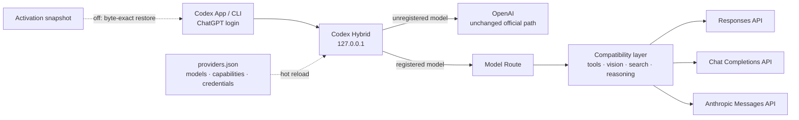

# Codex Hybrid

Use third-party models in Codex App without replacing your ChatGPT login, official models, or saved
tasks.

Codex Hybrid is a small local router for macOS. It keeps `model_provider = "openai"`, sends official
model names through the normal OpenAI path, and routes only model names you explicitly register.

- OpenAI Responses, Chat Completions, and Anthropic Messages upstreams
- Native or delegated vision, native or external web search
- Portable tools for providers without Codex namespaces or custom tools
- Provider-isolated reasoning and tool-call continuation
- Reversible `codex-hybrid on` / `codex-hybrid off`

> Experimental: Codex App/CLI internals can change between releases.

## How it works



The compatibility layer is per turn and only applies to registered third-party models:

- **Tools:** namespaces and custom tools can be converted to portable functions; large catalogs stay
  lazy while GitHub, browser/computer access, subagents, and vision remain available.
- **Vision:** `native` forwards images upstream; `delegated` turns the latest images into labeled
  Vision Evidence and exposes `analyze_image`.
- **Search:** `native` prioritizes the provider's `web_search`; `external` keeps MCP search such as
  Exa available.
- **Reasoning:** provider raw reasoning is shown through Codex's structured summary channel, while the
  original content is retained privately only for same-provider continuation. The first upstream
  chunk remains immediately visible, and raw reasoning is not sent to Remote as a raw event.

Official models bypass all four policies.

## Quick start

Requirements: macOS, Node.js 20.18.1 or newer, npm, and an existing Codex ChatGPT login.

```sh
git clone https://github.com/cibo17/codex-hybrid.git
cd codex-hybrid
npm run install:local
codex-hybrid on
```

Fully quit and reopen Codex App once so its startup-only model catalog reloads.

```sh
codex-hybrid status
codex-hybrid off
```

`on` snapshots the current Codex configuration, generates a model catalog, starts the local router,
and verifies health. `off` restores that snapshot byte-for-byte. Neither command edits or deletes
tasks.

The installer uses a standalone Node executable and does not depend on Hermes. Set
`CODEX_HYBRID_NODE=/absolute/path/to/node` only when automatic Node discovery is unsuitable.

## Add a provider

The registry lives at `~/.codex/hybrid/providers.json` and hot-reloads after edits. Invalid changes
leave the last-known-good registry active.

```json
{
  "version": 1,
  "providers": {
    "example": {
      "name": "Example Provider",
      "base_url": "https://api.example.com/v1",
      "credential": {
        "type": "env",
        "name": "EXAMPLE_API_KEY"
      },
      "models": {
        "example-coder": {
          "display_name": "Example Coder",
          "upstream_model": "provider-model-name",
          "api_protocol": "responses",
          "context_window": 262144,
          "reasoning_efforts": ["low", "medium", "high"],
          "default_reasoning_effort": "medium",
          "vision_mode": "delegated",
          "search_mode": "external",
          "tool_protocol": {
            "namespaces": "flatten",
            "custom_tools": "function",
            "deferred_tools": "code_mode",
            "tool_search": "passthrough"
          }
        }
      }
    }
  }
}
```

Supported API protocols:

- `responses` → `POST /responses`
- `chat_completions` → `POST /chat/completions`
- `anthropic_messages` → `POST /messages`

Provider URLs must use HTTPS; loopback HTTP is allowed for local servers. Model names must be unique.
Unregistered names are never sent to a third party.

### Credentials

Use a plaintext key, environment variable, macOS Keychain item, or no authentication:

```json
{ "type": "inline", "api_key": "plain-text-key" }
{ "type": "env", "name": "EXAMPLE_API_KEY" }
{ "type": "keychain", "service": "codex-hybrid-example", "account": "api-key" }
{ "type": "none" }
```

A `credential_pool` with `strategy: "fill_first"` can hold multiple entries. The first healthy key
stays preferred; retryable failures temporarily move traffic to the next key. A partially emitted
stream is never replayed through another credential.

### CLI

```sh
codex-hybrid provider list
codex-hybrid provider add example --base-url https://api.example.com/v1 --env EXAMPLE_API_KEY
codex-hybrid provider remove example

codex-hybrid key set example --env EXAMPLE_API_KEY
codex-hybrid key add example secondary --keychain-service example --keychain-account secondary
codex-hybrid key list example
codex-hybrid key remove example secondary

codex-hybrid model add example example-coder \
  --upstream-model provider-model-name \
  --api-protocol responses \
  --context-window 262144 \
  --efforts low,medium,high \
  --default-effort medium \
  --vision delegated \
  --search external
codex-hybrid model remove example-coder
```

Credential and registry changes hot-reload. After adding or removing a model, reopen Codex App to
refresh its model picker.

## Boundaries

- Codex Hybrid does not patch Codex App or CLI.
- Official models, voice/realtime traffic, login state, and tasks remain on their native paths.
- Exa is independent; add its official MCP directly if wanted.
- Generated registries, credentials, catalogs, runtime state, logs, backups, and local Codex config
  are excluded from Git.
- `CODEX_HYBRID_DIAGNOSTICS=1` writes complete diagnostic request bodies locally. They may contain
  private prompts, tool results, and paths; enable it only for bounded troubleshooting.

## Development

```sh
npm ci
npm test
```

The code follows a few narrow seams:

- `src/provider/` — registry, routing, capability profiles, and credential transport
- `src/tools/` — exposure policy, portable codec, collaboration history, and lazy catalogs
- `src/protocol/` — Responses SSE, Chat Completions, and Anthropic Messages adapters
- `src/vision/` — delegated image evidence
- `src/router.mjs` — local HTTP/WebSocket router
- `src/activation.mjs` — transactional activation and restore

See [domain language](docs/architecture/domain-language.md) and the
[Provider Registry ADR](docs/adr/0001-provider-registry-routing.md) for the detailed design.

## License

MIT
